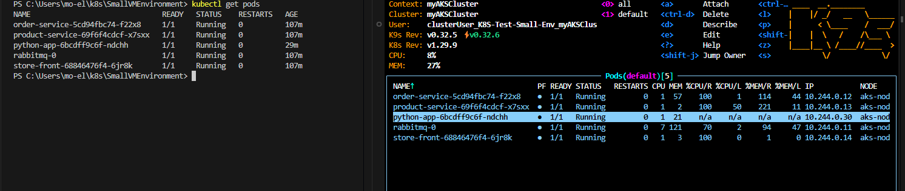
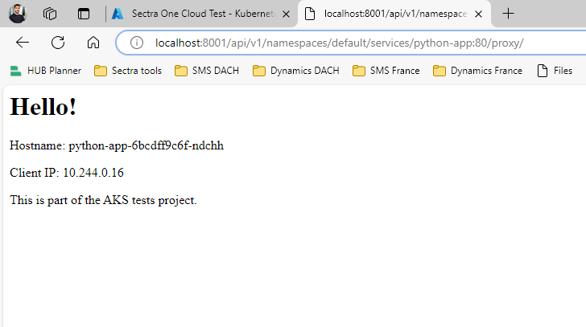

*This file describes the deployment of Azure Kubernetes Service (AKS) cluster using Azure CLI. We will also create a simple application, package it into a container image, upload the image to Docker Hub, and deploy the application.*

**Environment variables**

$MY_RESOURCE_GROUP_NAME="K8S-Test-Small-Env"

$REGION="swedencentral"

$MY_AKS_CLUSTER_NAME="myAKSCluster"

$MY_DNS_LABEL="mydnslabel"

**Resource group**

az group create --name $MY_RESOURCE_GROUP_NAME --location $REGION

*In case you encounter issues such as: MissingSubscriptionRegistration. You need to make sure to register the subscription to use the the missing namespace. follow the instructions in the "Solution" section of [Resolve errors for resource provider registration](https://learn.microsoft.com/en-us/azure/azure-resource-manager/troubleshooting/error-register-resource-provider?tabs=azure-portal#solution).*

**AKS Cluster**

az aks create --resource-group $MY_RESOURCE_GROUP_NAME --name $MY_AKS_CLUSTER_NAME --node-count 1 --generate-ssh-keys

*To connect to the cluster use the Kubernetes command-line client, kubectl. (If working locally, you would need to install kubectl first. Use the az aks install-cli command.)*

az aks get-credentials --resource-group $MY_RESOURCE_GROUP_NAME --name $MY_AKS_CLUSTER_NAME

*Verify the connection to the cluster*

kubectl get nodes

**Appication deployment**

*It is possible to use the manifest file aks-store-quickstart.yaml from Microsoft to test this. See https://learn.microsoft.com/en-us/azure/aks/learn/quick-kubernetes-deploy-cli*
*We will use a simple Python application using Flask*

*Create the Python environment and install Flask*

python3 -m venv venv

source venv/Scripts/activate

pip install Flask

**Create app.py**

*See the app.py file* 

**Create requirements.txt**

*See the requirements file (make it easier to install dependencies).*

**Dockerize the Python Application**

*Create "Dockerfile" to containerize the Flask app. See the Dockerfile*

**Build and push the Docker image**

*You may need to implement this Docker commands with privileged permissions or as admin.*

docker build -t <yourdockerhubusername>/python-app:latest .

docker login

docker push <yourdockerhubusername>/python-app:latest

**Kubernetes Manifest Files**

*Create the deployment file. See deployment.yaml*

*Create the service file. See service.yaml*

**Deploy to Kubernetes**

*Make sure to execute the kubectl commands without sudo or admin rights* 

kubectl apply -f deployment.yaml

kubectl apply -f service.yaml

*Make sure that the relevant pod is running:*

**Access the application**

*There are different ways to do so: via Nodeport, an external load balancer, Ingress Controller or kubectl proxy, etc.. In this case we are using the last option*

kubectl proxy

*On the browser, enter:*

http://localhost:8001/api/v1/namespaces/default/services/python-app:80/proxy/

*You should see the Flask web page:*

*make sure you're using the correct service name and port*

