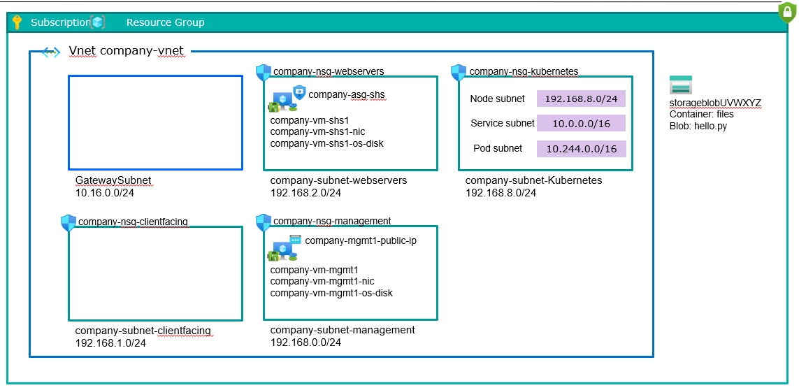

# Small Infrastructure environment with Azure Kubernetes Services

This environment creates a VNet with subnets to create a simplified, segmented environment similar to the company cloud environment. It sets up one of the NSGs to allow SSH from the HQ office network (or with VPN to it). This means that the VM(s) created on the management subnet can be accessed directly over the Internet using SSH.

The environment has two VMs, one on the Management subnet and one on the WebServers subnet. The latter simulates the main service in the company system that is called "SHS". It is installed with a simple web page that - for simplicity's sake - and returns a web page with "Hello, Aachen! When invoked with "/version", it returns the version of the application. The sidecar of our sample application is Redis, which we use to illustrate some concepts of containers/Kubernetes.

We will also integrate this environment with a managed Kubernetes cluster from Azure (AKS), using a VNet subnet from the existing environment.
As a network CNI, we used the Azure CNI Overlay model. This means that the pods receive IPs from a private CIDR. The pods will communicate directly over an Overlay network. Communication with endpoints outside of the cluster, such as on-premises is done using the node IP through NAT. In order for this to happen it is necessary to publish the pod's application as a Kubernetes Load Balancer service to make it reachable on the VNet.




## Environment variables


    $subscription = <subscription>
    $subscriptionID= <subscripton ID>
    $resourcegroup = <resource group>
    $location = <location>
    $clusterName= <AKS cluster name>

 
    $companyvnet = "company-vnet"
    $companysubnetmanagement = "company-subnet-management"
    $companysubnetwebservers = "company-subnet-webservers"
    $companysubnetclientfacing = "company-subnet-clientfacing"
    $companysubnetkubernetes = "company-subnet-kubernetes"
    $companygatewaysubnet = "GatewaySubnet"
    $companysubnetmanagementcidr = "192.168.0.0/24"
    $companysubnetclientfacingcidr = "192.168.1.0/24"
    $companysubnetwebserverscidr = "192.168.2.0/24"
    $companysubnetkubernetescidr = "192.168.8.0/24"
    $companygatewaysubnetcidr = "10.16.0.0/24"
    $companynsgmanagement = "company-nsg-management"
    $companynsgwebservers = "company-nsg-webservers"
    $companynsgclientfacing = "company-nsg-clientfacing"
    $companynsgkubernetes = "company-nsg-kubernetes"

    $companyasgshs = "company-asg-shs"


    $blobstoragebase = "storageblob"
    $blobcontainer = "files"
    $blobfile = "helloaachen.py"

    $companyvmmgmt1 = "company-vm-mgmt1"
    $companynicmgmt1 = "company-vm-mgmt1-nic"
    $companyosdiskmgmt1 = "company-vm-mgmt1-os-disk"
    $companypipmgmt1 = "company-vm-mgmt1-public-ip"

    $companyvmshs1 = "company-vm-shs1"
    $companynicshs1 = "company-vm-shs1-nic"
    $companyosdiskshs1 = "company-vm-shs1-os-disk"
    
    
    

## Create Resource Group

    az group create --subscription $subscription --name $resourcegroup --location $location


## Create NSGs, virtual network and subnets

    az network asg create --location $location --subscription $subscription --resource-group $resourcegroup --name $companyasgshs

    az network nsg create --location $location --subscription $subscription --resource-group $resourcegroup --name $companynsgmanagement
    
    az network nsg rule create --subscription $subscription --resource-group $resourcegroup --nsg-name $companynsgmanagement --name "SSHFromcompany" --priority 200 --access Allow --direction Inbound --protocol tcp --source-address-prefixes 88.131.68.200 88.131.68.201 88.131.68.202 --source-port-ranges * --destination-address-prefixes * --destination-port-ranges 22

    az network nsg create --location $location --subscription $subscription --resource-group $resourcegroup --name $companynsgwebservers
    
    az network nsg create --location $location --subscription $subscription --resource-group $resourcegroup --name $companynsgclientfacing

    az network nsg create --location $location --subscription $subscription --resource-group $resourcegroup --name $companynsgkubernetes

    az network vnet create --location $location --subscription $subscription --resource-group $resourcegroup --name $companyvnet --address-prefixes $companysubnetmanagementcidr $companygatewaysubnetcidr $companysubnetwebserverscidr $companysubnetclientfacingcidr $companysubnetkubernetescidr

    az network vnet subnet create --subscription $subscription --resource-group $resourcegroup --vnet-name $companyvnet --name $companysubnetmanagement --address-prefixes $companysubnetmanagementcidr --network-security-group $companynsgmanagement

    az network vnet subnet create --subscription $subscription --resource-group $resourcegroup --vnet-name $companyvnet --name $companygatewaysubnet --address-prefixes $companygatewaysubnetcidr

    az network vnet subnet create --subscription $subscription --resource-group $resourcegroup --vnet-name $companyvnet --name $companysubnetwebservers --address-prefixes $companysubnetwebserverscidr --network-security-group $companynsgwebservers

    az network vnet subnet create --subscription $subscription --resource-group $resourcegroup --vnet-name $companyvnet --name $companysubnetclientfacing --address-prefixes $companysubnetclientfacingcidr --network-security-group $companynsgclientfacing

    az network vnet subnet create --subscription $subscription --resource-group $resourcegroup --vnet-name $companyvnet --name $companysubnetkubernetes --address-prefixes $companysubnetkubernetescidr --network-security-group $companynsgkubernetes


## Create storage account and upload files needed to deploy sample VMs

    $blobstorage = az storage account list --subscription $subscription --resource-group $resourcegroup --query "[?contains(name, '$blobstoragebase')].name" -o tsv
    
    if ([string]::IsNullOrWhiteSpace($blobstorage)) {
        $rndnumber = Get-Random
        $blobstorage = "$blobstoragebase$rndnumber"

        az storage account create --subscription $subscription --resource-group $resourcegroup --location $location --name $blobstorage --access-tier hot --sku standard_lrs --public-network-access Enabled

        az storage container create --account-name $blobstorage --name $blobcontainer --auth-mode login

        $blobkey = az storage account keys list --subscription $subscription --account-name $blobstorage --query "[0].value" --output tsv

        az storage blob upload --account-name $blobstorage --container-name $blobcontainer --file $blobfile --name $blobfile --account-key $blobkey
    }


## Create VMs

    # Create VM in Mgmt subnet with public IP. This allows SSH from company network according to NSG above
    az network public-ip create --subscription $subscription --location $location --resource-group $resourcegroup --name $companypipmgmt1 --allocation-method Static
    az network nic create --subscription $subscription --location $location --resource-group $resourcegroup --vnet $companyvnet --subnet $companysubnetmanagement --name $companynicmgmt1 --public-ip-address $companypipmgmt1
    az vm create --subscription $subscription --location $location --resource-group $resourcegroup --name $companyvmmgmt1 --nics $companynicmgmt1 --image Canonical:0001-com-ubuntu-server-focal-daily:20_04-daily-lts-gen2:Latest --os-disk-name $companyosdiskmgmt1 --os-disk-size-gb 30 --size Standard_B1s --authentication-type password --admin-username ubuntu --admin-password <test password>

    # Get URL to Python file for simple web page (based on SAS-token)
    $blobstorage = az storage account list --subscription $subscription --resource-group $resourcegroup --query "[?contains(name, '$blobstoragebase')].name" -o tsv
    $blobkey = az storage account keys list --subscription $subscription --account-name $blobstorage --query "[0].value" --output tsv
    $blobtoken = az storage container generate-sas --account-name $blobstorage --name files --https-only --account-key $blobkey --permission r --start (Get-Date).ToString("yyyy-MM-dd") --expiry (Get-Date).AddDays(1).ToString("yyyy-MM-dd") --output tsv
    $blobpythonscripturl = "https://$blobstorage.blob.core.windows.net/files/helloaachen.py?" + $blobtoken

    # Create VM in Web Server subnet. Download and configure simple web page based on Python file from Blob Storage above
    az network nic create --subscription $subscription --location $location --resource-group $resourcegroup --vnet $companyvnet --subnet $companysubnetwebservers --name $companynicshs1 --application-security-groups $companyasgshs
    az vm create --subscription $subscription --location $location --resource-group $resourcegroup --name $companyvmshs1 --nics $companynicshs1 --image Canonical:0001-com-ubuntu-server-focal-daily:20_04-daily-lts-gen2:Latest --os-disk-name $companyosdiskshs1 --os-disk-size-gb 30 --size Standard_B1s --authentication-type password --admin-username ubuntu --admin-password <test password>
    az vm run-command invoke --subscription $subscription --resource-group $resourcegroup --name $companyvmshs1 --command-id RunShellScript --scripts "wget '$blobpythonscripturl' -O /home/ubuntu/helloaachen.py"
    az vm run-command invoke --subscription $subscription --resource-group $resourcegroup --name $companyvmshs1 --command-id RunShellScript --scripts "sudo crontab -l | { cat; echo '@reboot python3 /home/ubuntu/helloaachen.py'; } | sudo crontab -"
    az vm run-command invoke --subscription $subscription --resource-group $resourcegroup --name $companyvmshs1 --command-id RunShellScript --scripts "python3 /home/ubuntu/helloaachen.py &"


## Create the AKS Cluster:

*Create the AKS cluster with node pool configuration using "company-subnet-Kubernetes" subnet. We are using the Overlay netowkring model and we enable network policy to implement the network segmentation. Futhermore we enable RBAC to manage access controls and Istio-based service mesh add-on for Gateway API and we secure access to the API server using authorized IP address ranges*
```sh
az aks create --name $clusterName --resource-group $resourceGroup --location $location --node-count 2 --vnet-subnet-id /subscriptions/$subscriptionID/resourceGroups/$resourceGroup/providers/Microsoft.Network/virtualNetworks/$companyvnet/subnets/$companysubnetkubernetes --network-plugin azure --network-plugin-mode overlay --network-policy azure --pod-cidr 10.244.0.0/16 --dns-service-ip 10.0.0.10 --service-cidr 10.0.0.0/16 --generate-ssh-keys --enable-aad --enable-azure-rbac --enable-app-routing --api-server-authorized-ip-ranges 88.131.68.200,88.131.68.201,88.131.68.202
```


## Verify the network configuration:
```sh
Download credentials and configures the Kubectl to use them:
az aks get-credentials -n $clusterName -g $resourceGroup
#Merged "AKS-Cluster" as current context in C:\Users\mo-el\.kube\config

kubectl config use-context AKS-Cluster
#Switched to context "AKS-Cluster".

kubectl get node -o wide
#aks-nodepool1-22495599-vmss000000   Ready    <none>   105m   v1.29.9   192.168.8.4   <none>        Ubuntu 22.04.5 LTS   5.15.0-1074-azure   containerd://1.7.23-1
#aks-nodepool1-22495599-vmss000001   Ready    <none>   105m   v1.29.9   192.168.8.5   <none>        Ubuntu 22.04.5 LTS   5.15.0-1074-azure   containerd://1.7.23-1

kubectl get pod -o wide -n kube-system
#kube-proxy-hts9g                      1/1     Running   0          97m   192.168.8.4    aks-nodepool1-22495599-vmss000000 -> This pod for instance is using host networking.
#metrics-server-f46f56d7b-hncmh        2/2     Running   0          96m   10.244.1.195   aks-nodepool1-22495599-vmss000000 -> This pod has an IP address from the Pod CIDR.

az aks show -n $clusterName -g $resourceGroup --query networkProfile.podCidr -o tsv
#10.244.0.0/16 -> Pod CIDR

az aks show -n $clusterName -g $resourceGroup --query networkProfile.serviceCidr -o tsv
#10.0.0.0/16 -> service CIDR

az aks show -n $clusterName -g $resourceGroup --query networkProfile.dnsServiceIp -o tsv
#10.0.0.10 -> DNS service IP
```

## Create role assignments for cluster access
Get your AKS resource ID
```sh
AKS_ID=$(az aks show --resource-group $RESOURCE_GROUP --name $CLUSTER_NAME --query id --output tsv)
```

Create a role assignment. The following example creates a role assignment for the Azure Kubernetes Service RBAC Admin role.
```sh
az role assignment create --role "Azure Kubernetes Service RBAC Admin" --assignee <AAD-ENTITY-ID> --scope $AKS_ID
```

## Use Azure RBAC for Kubernetes Authorization with kubectl

Make sure you have the Azure Kubernetes Service Cluster User built-in role, and then get the kubeconfig of your AKS cluster using the az aks get-credentials command.
```sh
az aks get-credentials --resource-group $RESOURCE_GROUP --name $CLUSTER_NAME
```


## Create NAT Gateway
Create public IP address
```sh
az network public-ip create --resource-group K8S-Test-Small-Env --name public-ip-nat --sku Standard --location swedencentral
```
Create NAT gateway resource
```sh
az network nat gateway create --resource-group K8S-Test-Small-Env --name nat-gateway --public-ip-addresses public-ip-nat --idle-timeout 10 --location swedencentral
```

Configure NAT service for source subnet
```sh
az network vnet subnet update --name sectra-subnet-management --resource-group K8S-Test-Small-Env --vnet-name sectra-vnet --nat-gateway nat-gateway

az network vnet subnet update --name sectra-subnet-webservers --resource-group K8S-Test-Small-Env --vnet-name sectra-vnet --nat-gateway nat-gateway

az network vnet subnet update --name sectra-subnet-clientfacing --resource-group K8S-Test-Small-Env --vnet-name sectra-vnet --nat-gateway nat-gateway

az network vnet subnet update --name sectra-subnet-kubernetes --resource-group K8S-Test-Small-Env --vnet-name sectra-vnet --nat-gateway nat-gateway
```
## Create Azure Application Gateway

Create a public IP address for the Application Gateway 
```sh
az network public-ip create \
  --resource-group K8S-Test-Small-Env \
  --name myAGPublicIPAddress \
  --allocation-method Static \
  --sku Standard
```

Create the application gateway
```sh
address=$(az network nic show --name sectra-vm-shs1-nic --resource-group K8S-Test-Small-Env | grep "\"privateIPAddress\":" | grep -oE '[^ ]+$' | tr -d '",')

az network application-gateway create --name myAppGateway --location swedencentral --resource-group K8S-Test-Small-Env --sku Standard_v2 --public-ip-address myAGPublicIPAddress --vnet-name sectra-vnet --subnet GatewaySubnet --servers "$address" --priority 100
```

## Create a key vault
```sh
az keyvault create --name SmallEnvKeyVault --resource-group K8S-Test-Small-Env
```

## Create a container registry
```sh
az acr create --resource-group K8S-Test-Small-Env --name smallenvcontainerreg --sku Basic
```
